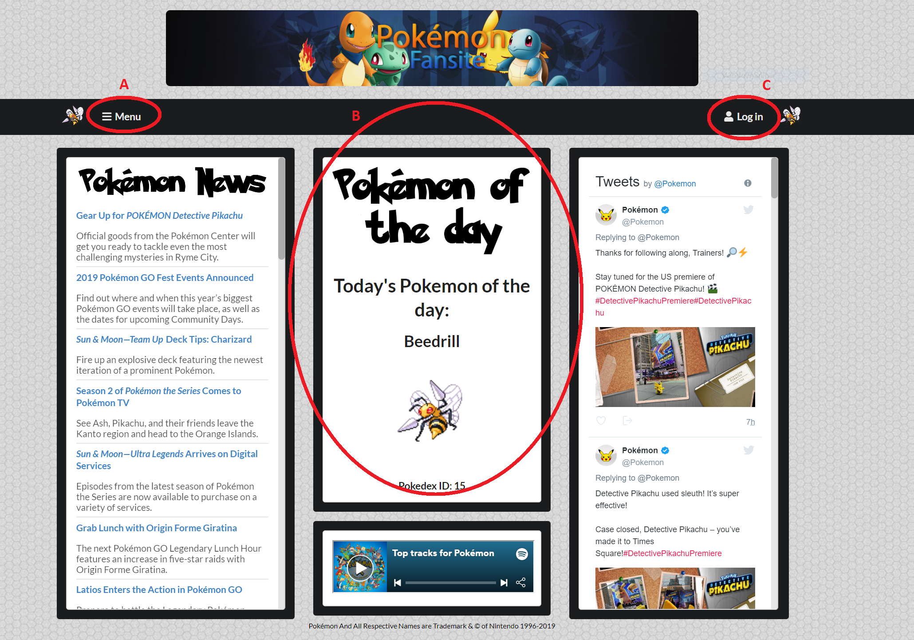

# Pokémon Fansite API

## Users Methods
#### GET /all_users (_url: localhost:8090/all_users_)
Returns JSON file with the usernames of all registered users

**Parameters:** none
#### POST /sign_up_submit (_url: localhost:8090/sign_up_submit_)
Sends user's details to the server, where a profile is generated and stored. Passwords are hashed before being stored.

**Parameters:** 
- _uname_ - username
- _fname_ - forename
- _sname_ - surname
- _password_ - password

## Pokémon-related Methods
#### GET /all_pokemon (_url: localhost:8090/all_pokemon_)
Returns JSON file with the names of all existing pokémon

**Parameters:** none
#### GET /pokemon (_url: localhost:8090/pokemon?pokeid=POKEID_)
Takes as its input a Pokedex ID, then using the pokemon API, returns an object containing the details of that pokemon

**Parameters:**
#### GET /potd (_url: localhost:8090/potd_)
Uses the current date to determine the "pokemon of the day" then using the pokemon API, returns an object containing the details of that pokemon.

**Parameters:** - None
#### GET /fav (_url: localhost:8090/fav_)
Returns a list of a users favourite pokémon as a JSON

**Parameters:**
- _uname_ - username of target
#### POST /add_fav (_url: localhost:8090/api/add_fav_)
Adds a given pokémon to the favourites of the user. **Requires authentication**

**Parameters:** 
- _pokeID_ - the pokédex ID of the pokemon to be added to favourites
- _token_ - A authentication token provided by the server on login
#### POST /delete_fav (_url: localhost:8090/api/delete_fav_)
Removes a given pokémon from the favourites of the user. **Requires authentication**

**Parameters:**
- _pokeID_ - the pokédex ID of the pokemon to be removed from favourites
- _token_ - A authentication token provided by the server on login

## Login Methods
#### POST /login (_url: localhost:8090/login_)
Sends credentials to server which checks them against registered users, returns successful if details are accurate or with an error if not.

**Parameters:**
- _uname_ - username
- _password_ - password
#### GET /cookie_check (_url: localhost:8090/cookie_check_)
Makes contact with the server to validate any relevant login cookies

**Parameters:** - None
#### GET /logout (_url: localhost:8090/logout_)
Requests logout confirmation from server

**Parameters:** - None
#### POST /gsignin (_url: localhost:8090/gsignin_)
Google Sign in: sends login token to server for validation and receives user info as a response

**Parameters:**
- _idtoken_ - Auth token supplied by Google on successful sign-in
## Webpage Methods
#### GET /home (_url: localhost:8090/home_)
Returns HTML suitable for a website homepage

**Parameters:** - None
#### GET /pokedex (_url: localhost:8090/pokedex_)
Returns HTML suitable for a website pokedex page

**Parameters:** - None
#### GET /favourites (_url: localhost:8090/favourites_)
Returns HTML suitable for a website user favourite lookup page

**Parameters:** - None

#### GET /loginPage (_url: localhost:8090/loginPage_)
Returns HTML suitable for a website user favourite lookup page

**Parameters:** - None
#### GET /account (_url: localhost:8090/account_)
Returns HTML suitable for a website user-favourite-lookup page

**Parameters:** - None
#### GET /pages (_url: localhost:8090/pages_)
Returns JSON containing the page names in the example website's sidebar

**Parameters:** - None
#### GET /rss (_url: localhost:8090/rss_)
Returns an RSS feed parsed by the server and converted to HTML suitable for embedding into a website
**Parameters:** - None

# Webpage: Pokémon Fansite
### Website layout:
 
 
* **A** -  _The menu_: Opens the website's sidebar, allowing for navigation between the main content pages (see Pages section below)
* **B** - _The canvas_: This is the main interactive section of the webpage; while the rest of the page remains static, this section dynamically changes as the website is navigated.
* **C** - _Login_: Clicking on this will take you to the login page (see more details below). Once logged in, this button will change to show what account you're using, and clicking here will allow you to access the Account page.
 ## Pages
 ### Home page/Pokemon of the Day page
Each day this page will show a different pokemon to the day before!
 
 ### Pokedex
 This page allows users to search pokemon by either name or Pokedex ID. The search function will automatially suggest searches as you type, and the pokemon information provided comes from the Pokemon API*. Once logged in the Pokedex is used to add or remove pokemon from the user's favourites.

 
 ### User Favourites
 This page allows the user to search for other users and view their favourite pokemon. Similar to the pokedex, this search function will automatially suggest searches as you type. 
 
 ### Login Page
 Here you can login either using an email and password, or via Google sign-in. If you're a new user you can also sign up!
 
 ### Account Page
 In the account page you can view your own favourite pokemon. From here you can also easily remove Pokemon from your favourites.
 
 **\*N.B.** The Pokemon API has a fixed limit of 100 API requests per IP address per minute, this has never been an issue during development, but it should be noted

